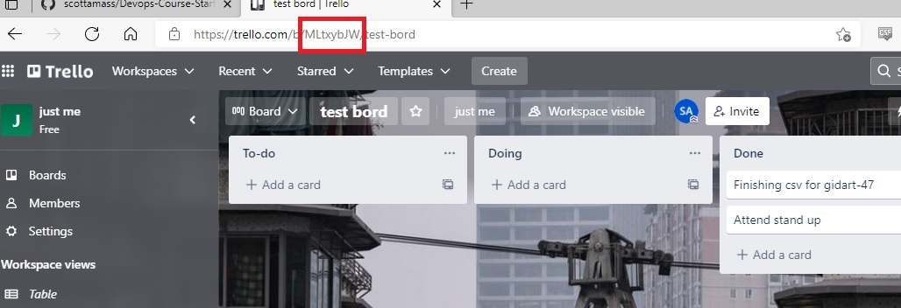

# DevOps Apprenticeship: Project Exercise

## System Requirements

The project uses poetry for Python to create an isolated environment and manage package dependencies. To prepare your system, ensure you have an official distribution of Python version 3.7+ and install Poetry using one of the following commands (as instructed by the [poetry documentation](https://python-poetry.org/docs/#system-requirements)):

### Poetry installation (Bash)

```bash
curl -sSL https://raw.githubusercontent.com/python-poetry/poetry/master/install-poetry.py | python -
```

### Poetry installation (PowerShell)

```powershell
(Invoke-WebRequest -Uri https://raw.githubusercontent.com/python-poetry/poetry/master/install-poetry.py -UseBasicParsing).Content | python -
```

## Dependencies

The project uses a virtual environment to isolate package dependencies. To create the virtual environment and install required packages, run the following from your preferred shell:

```bash
$ poetry install
```

You'll also need to clone a new `.env` file from the `.env.template` to store local configuration options. This is a one-time operation on first setup:

```bash
$ cp .env.template .env  # (first time only)
```

The `.env` file is used by flask to set environment variables when running `flask run`. This enables things like development mode (which also enables features like hot reloading when you make a file change). There's also a [SECRET_KEY](https://flask.palletsprojects.com/en/1.1.x/config/#SECRET_KEY) variable which is used to encrypt the flask session cookie.

## Running the App

Once the all dependencies have been installed, start the Flask app in development mode within the Poetry environment by running:
```bash
$ poetry run flask run
```

You should see output similar to the following:
```bash
 * Serving Flask app "app" (lazy loading)
 * Environment: development
 * Debug mode: on
 * Running on http://127.0.0.1:5000/ (Press CTRL+C to quit)
 * Restarting with fsevents reloader
 * Debugger is active!
 * Debugger PIN: 226-556-590
```
Now visit [`http://localhost:5000/`](http://localhost:5000/) in your web browser to view the app.


go to the trello api docs to get your trello key and replace the place holders in the env template with your api and token key 
bord id can been found in the address bar see exmaple below 

go to the CONFIG.py file and update your bord varible with the board varible from trello board 


## TESTING 
unit tests have be added to this project for the following :

# adding items to a doing list 
# adding items to a done list 

# adding items to a To-do list 

to run all tests navigte to the project folder and run the command "pytest" to run all the tests 


DOCKER CONTAINERS 
A Docker container has been added to to the projecy to build the container run 
#to build a production container run 
docker build --target prod --tag todo-app:prod .
#to build a dev enviroment run 
docker build --target dev --tag todo-app:dev .  

and to run the conainer 
prod:
docker run -e DEV=0 --env-file .env  -p 80:8000 todo-app:prod
Dev:
docker run -e DEV=1 --env-file .env -p 5000:5000 --mount type=bind,source="$(pwd)"/todo_app,target=/opt/todoapp/todo_app todo-app:dev
before running you will need to create a .env in your prject directory to pass in using the .env.template as a guide 


## Run Terraform locally
Run "terraform init"

The following variable will either need to be added using -var tag or in a .tfvars file:
GIT_HUB_CLIENT_ID
GIT_HUB_SECRET
prefix

See variables.tf for optional variables.

Run "terraform apply"

## Azure Link

https://test-terratodoappkl.azurewebsites.net


## Deploying via Kubenties via minikube 

locate the "todo-secret.yml.template" and rename to "todo-secret.yml" and fill in the relevent details on the form 

make sure docker is running and spin up the minikube server 

```js
minikube start
```
build a local image using docker with the command 
```
ddocker build --target prod --tag todo-app:prod .  
```
and apply the image
```
minikube image load <image_name>
```
apply your images 
```
kubectl apply -f deployment.yaml 
kubectl apply -f todo-secrets.yaml 
kubectl apply -f service.yaml
```
and run the port forwarder 

```
kubectl port-forward service/module-14 7080:80
```

you can now view the app on http://127.0.0.1:7080
